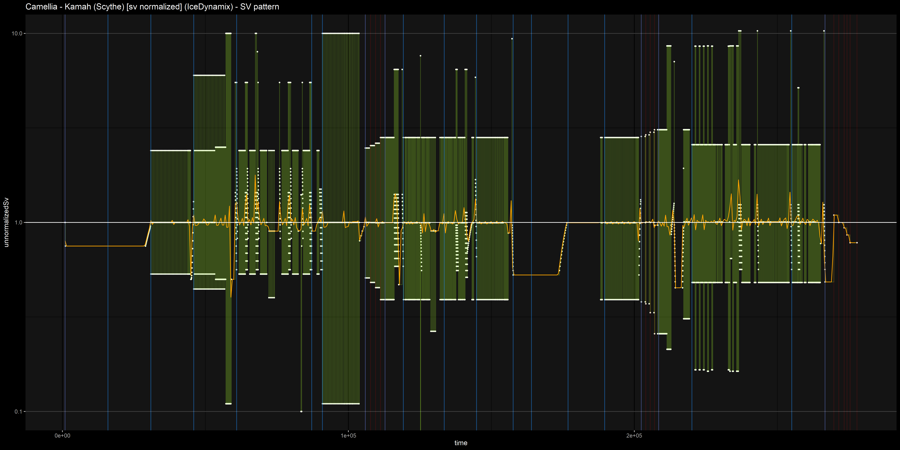

# osuSvPlotter

Generates a SV Plot image based on the timing points. Although made with osu!mania in mind, it can handle standard and taiko as well, although it won't be of as much use. [Sample charts and beatmaps](https://github.com/IceDynamix/osuSvPlotter/blob/master/samples/samples.md) are provided in the samples folder, along with their output images. I used beatmaps from other mappers for the other gamemodes, please contact me if you'd like me to remove them from this repository.

## Run the app

- Install the [R language](https://www.r-project.org/)
- Install all necessary packages? Run `install.packages("package_name")` for each package? *idk ive never managed a R project before*
  - ggplot2
  - dpylr
  - ggdark
- Run `sv-plot.R`

A file picker should pop up and make you select a .osu file. The output file should show up in the root directory as `output.png`

Inspired by [Evening](https://github.com/eve-ning) and his [work on VSRG charts with R](https://github.com/Eve-ning/vsrgtools)
Thank you for everything you've done so far
